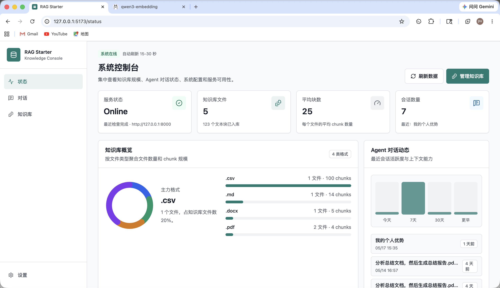
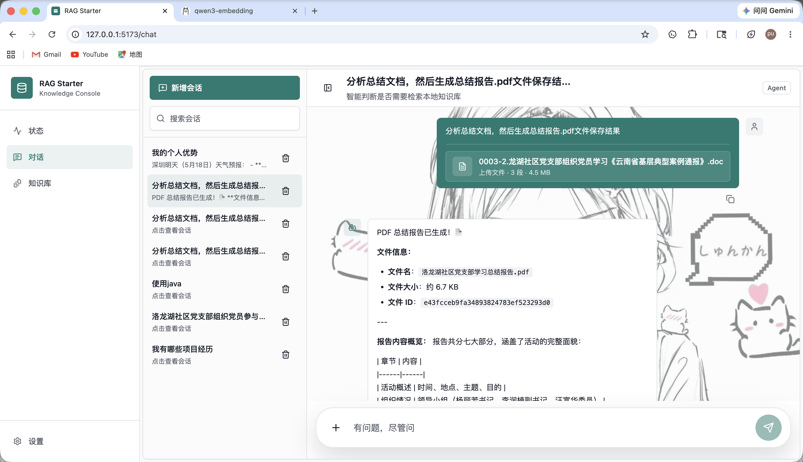
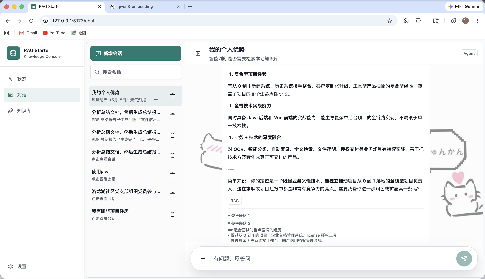
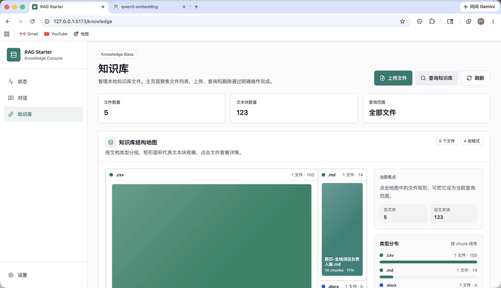
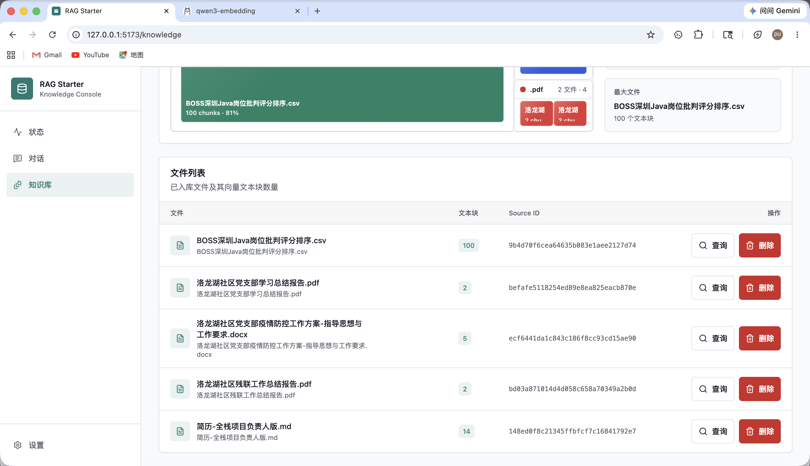
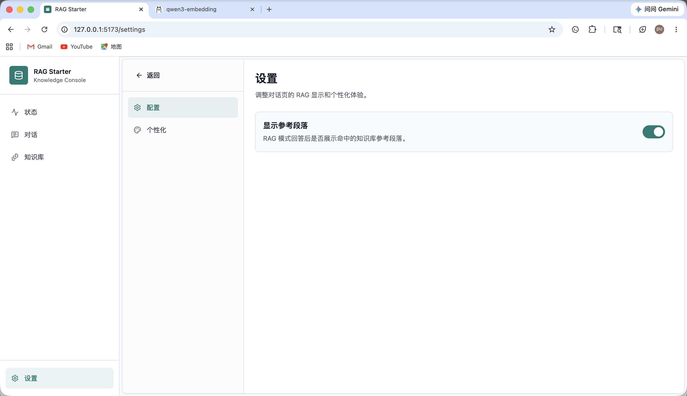
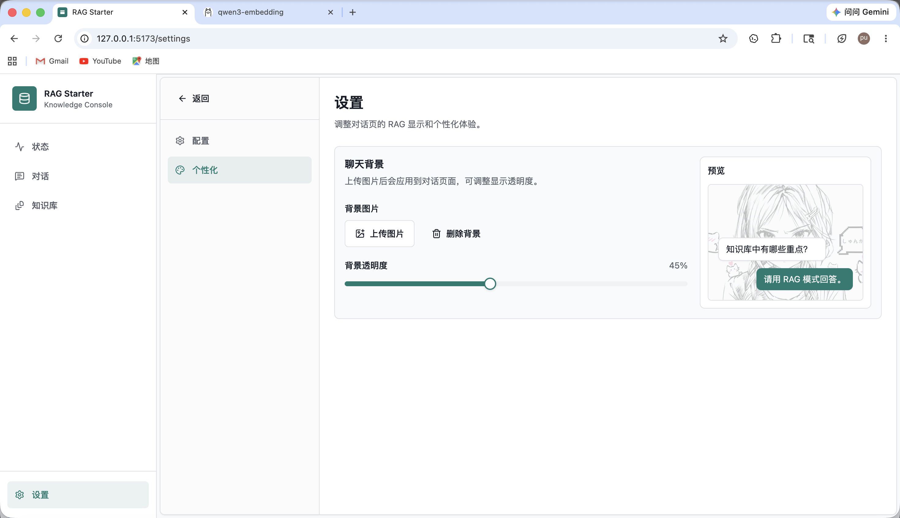

# RAG Starter

RAG Starter 是一个基于 LangChain、FastAPI、Chroma 和 React 的本地 RAG/Agent 应用模板，覆盖从文档上传、解析、分割、去重、向量入库、检索重排序，到多工具 Agent 对话、文档生成、会话持久化和前端展示的完整链路。

它适合用于：

- 学习 RAG 工程化落地方式
- 快速搭建企业内部知识库问答系统
- 作为支持多文档格式、可扩展工具链的二次开发起点

## 主要能力

- 多格式文档加载：支持 Markdown、TXT、PDF、Word、Excel、PPT、HTML、JSON、CSV、图片 OCR 等常见格式。
- 专项文档分割：针对 PDF、Markdown、Word、Excel 进行了结构化优化，尽量保留标题、表格、章节和正文上下文。
- 文件级与 chunk 级去重：同一文件重复上传会被拒绝，单文件内部重复 chunk 也会被过滤。
- 本地向量数据库：使用 Chroma 持久化存储知识库数据。
- 双 embedding 方案：支持阿里云百炼 `text-embedding-v4` 和本地 Ollama `qwen3-embedding:4b`。
- 两阶段检索：先向量召回更多候选，再用 reranker 精排后返回 top-n。
- Agent 自动工具调用：模型可自动决定是否调用知识库检索、天气查询、文档生成、临时附件读取等工具。
- 临时对话附件：聊天时上传的文件仅供当前会话读取，不进入知识库。
- 文档生成：支持生成 Markdown、Word、Excel、PDF，并提供浏览器下载。
- 本地持久化：会话、消息、设置等数据使用 SQLite 保存。
- 用户端前端：提供状态控制台、对话、知识库、设置等页面。

## 技术栈

后端：

- Python 3.11+
- FastAPI
- LangChain / LangChain Core / LangChain Chroma
- ChromaDB
- SQLite / SQLAlchemy
- DeepSeek OpenAI-compatible Chat API
- DashScope OpenAI-compatible Embedding API
- Ollama local embedding API
- BAAI/bge-reranker-v2-m3 或本地 Ollama reranker

前端：

- Vite
- React
- TypeScript
- Tailwind CSS
- TanStack Query
- React Router
- lucide-react

## 项目结构

```text
rag-starter/
├── src/
│   ├── agent/                 # Agent 编排和工具注册
│   ├── api/                   # FastAPI 应用和接口 schema
│   ├── chat_files/            # 对话临时上传文件管理
│   ├── document_generator/    # Markdown/Word/Excel/PDF 文档生成
│   ├── embedding/             # DashScope、Ollama、Hash embedding 实现
│   ├── loader/                # 各类型文档加载器
│   ├── rag/                   # RAG 问答服务
│   ├── reranker/              # 重排序模型适配
│   ├── retrieval/              # 召回 + rerank 检索服务
│   ├── splitter/              # 文档分割器
│   ├── storage/               # SQLite 会话和设置持久化
│   └── vector_store/          # Chroma 向量库封装
├── tests/                     # 后端单元测试
├── web/                       # React 前端
├── .env.example               # 环境变量示例
├── pyproject.toml             # Python 项目配置
└── README.md
```

## 快速开始

### 1. 克隆项目

```bash
git clone https://github.com/<your-name>/rag-starter.git
cd rag-starter
```

### 2. 创建 Python 虚拟环境

```bash
python -m venv .venv
source .venv/bin/activate
```

Windows PowerShell：

```powershell
.venv\Scripts\Activate.ps1
```

### 3. 安装依赖

基础安装：

```bash
pip install -e .
```

如果需要覆盖更多文档格式，建议安装 loader 可选依赖：

```bash
pip install -e ".[loaders]"
```

如果需要启用本地 BGE 重排序模型：

```bash
pip install -e ".[reranker]"
```

## 环境配置

复制示例环境变量文件：

```bash
cp .env.example .env
```

至少需要配置一个 LLM API Key：

```env
DEEPSEEK_API_KEY=your_deepseek_api_key
```

### Embedding

支持两种主流配置：

**阿里云百炼**

```env
RAG_EMBEDDING_PROVIDER=dashscope
DASHSCOPE_API_KEY=your_dashscope_api_key
DASHSCOPE_BASE_URL=https://dashscope.aliyuncs.com/compatible-mode/v1
DASHSCOPE_EMBEDDING_MODEL=text-embedding-v4
DASHSCOPE_EMBEDDING_DIMENSION=2048
```

**本地 Ollama**

```env
RAG_EMBEDDING_PROVIDER=ollama
OLLAMA_BASE_URL=http://127.0.0.1:11434
OLLAMA_EMBEDDING_MODEL=qwen3-embedding:4b
OLLAMA_EMBEDDING_DIMENSION=2560
```

不同 embedding 模型的向量空间不兼容。切换模型或维度后，请删除旧的 Chroma 数据并重新索引知识库。

```bash
rm -rf storage/chroma
```

### 重排序模型

推荐使用两阶段检索链路：

1. 先从向量库召回更多候选。
2. 再用 cross-encoder reranker 进行精排。
3. 最后返回 top-n 结果给 RAG 或 Agent。

默认支持：

- `bge`：使用 `BAAI/bge-reranker-v2-m3`
- `ollama`：使用本地 `dengcao/bge-reranker-v2-m3`
- `disabled`：关闭重排序

```env
RAG_RERANKER_PROVIDER=bge
RAG_RERANKER_MODEL=BAAI/bge-reranker-v2-m3
RAG_RERANKER_DEVICE=cpu
RAG_RERANKER_NORMALIZE=true
RAG_RETRIEVAL_MIN_CANDIDATE_K=12
RAG_RETRIEVAL_CANDIDATE_MULTIPLIER=5
RAG_RETRIEVAL_MAX_CANDIDATE_K=40
RAG_TOOL_MAX_K=8
RAG_TOOL_MAX_CALLS=3
```

说明：

- 向量检索的 `score` 是 Chroma 距离分数，越低越相近。
- reranker 的 `rerank_score` 是相关度分数，越高越相关。
- 工具层默认返回较小的 `k`，如果模型判断还不够，可以再次调用检索工具获取更多候选。

## 启动服务

### 后端

```bash
uvicorn src.api.main:app --reload
```

默认 API 地址：`http://127.0.0.1:8000`

### 前端

```bash
cd web
npm install
npm run dev
```

默认前端地址：`http://127.0.0.1:5173`

如需覆盖 API 地址，可在 `web/.env.local` 中配置：

```env
VITE_API_BASE_URL=http://127.0.0.1:8000
```

## 核心工作流

### 1. 知识库索引

```text
上传文件 -> loader 解析 -> splitter 分割 -> 文件级去重 -> chunk 级去重 -> embedding -> 写入 Chroma
```

### 2. 检索增强生成

```text
用户问题 -> embedding -> 向量召回候选 -> reranker 精排 -> Prompt 组装 -> LLM -> 回答
```

### 3. Agent 对话

Agent 不再要求用户手动选择 LLM 或 RAG 模式，而是根据问题和工具描述自动判断是否调用工具。

当前内置工具包括：

- `search_knowledge_base`：检索本地知识库
- `read_uploaded_document`：读取当前对话上传文件
- `generate_document`：生成文档
- `get_current_date`：获取当前日期
- `get_current_location_city`：获取默认城市
- `query_weather`：查询天气

### 4. 临时附件

聊天输入框支持左侧 `+` 菜单添加文件，也支持拖拽上传。临时附件仅服务当前会话，不会进入知识库。

### 5. 文档生成

Agent 可以把对话内容或分析结果转成文档并提供下载。

支持格式：

- `.md`
- `.docx`
- `.xlsx`
- `.pdf`

## 分割器说明

`src/splitter` 提供统一的文档分割入口，并对 PDF、Word、Markdown、Excel 做了专项处理。

### 默认分割逻辑

- 通用文本优先使用递归字符分割。
- Markdown / Word / PDF 使用标题树结构保留章节语义。
- Excel 按工作表、表头、数据行组织为可检索文本。

### Markdown / Word / PDF 优化

这三类文档不再简单按字符硬切，而是尽量保留：

- 标题与正文的上下文关系
- 同级章节的语义边界
- 连续标题和空正文的结构信息
- 表格、页码、章节来源等 metadata

这样可以减少“标题和正文被拆到不同 chunk”导致的检索失真。

### PDF 处理

PDF 解析优先使用结构化文本提取，再按章节聚合为 chunk，尽量保留页面范围、标题层级和表格信息。

更多实现说明见：

- [src/loader/README.md](src/loader/README.md)
- [src/splitter/README.md](src/splitter/README.md)

## 前端页面

当前前端包含以下页面：

- **状态**：系统控制台，展示知识库、会话、服务状态和数据概览。
- **对话**：Agent 对话页，支持上下文记忆、临时附件、流式输出、Markdown 渲染和结果复制。
- **知识库**：文件列表、上传、查询、删除，并提供结构化知识库展示视图。
- **设置**：RAG 参考段落开关和聊天背景个性化配置。

## 界面预览

### 状态控制台



### 对话页面

Agent 生成文档并返回下载结果：



RAG 命中知识库后展示参考段落：



### 知识库页面

知识库结构地图：



知识库文件列表：



### 设置页面

RAG 参考段落显示开关：



聊天背景个性化配置：



## API 概览

### 系统

| 方法 | 路径 | 说明 |
| --- | --- | --- |
| `GET` | `/health` | 健康检查 |

### 知识库

| 方法 | 路径 | 说明 |
| --- | --- | --- |
| `GET` | `/documents` | 列出已入库知识库文件 |
| `POST` | `/index` | 上传文件并索引到向量库 |
| `POST` | `/documents` | 按本地路径加载并索引文件 |
| `DELETE` | `/documents` | 按 `ids`、`source_id` 或 `source` 删除向量记录 |
| `POST` | `/search` | 相似度检索 |

### 对话

| 方法 | 路径 | 说明 |
| --- | --- | --- |
| `POST` | `/chat` | 普通 LLM 对话 |
| `POST` | `/rag/chat` | RAG 增强对话 |
| `POST` | `/agent/chat` | Agent 智能对话 |
| `POST` | `/chat/files` | 上传对话临时附件 |
| `GET` | `/chat/sessions` | 列出会话 |
| `GET` | `/chat/sessions/{session_id}` | 获取会话详情 |
| `DELETE` | `/chat/sessions/{session_id}` | 删除会话 |

### 文档生成

| 方法 | 路径 | 说明 |
| --- | --- | --- |
| `GET` | `/generated-documents/{file_id}/download` | 下载 Agent 生成的文档 |

### 设置

| 方法 | 路径 | 说明 |
| --- | --- | --- |
| `GET` | `/settings` | 获取用户设置 |
| `PUT` | `/settings` | 更新用户设置 |

## 配置说明

所有运行配置集中在 [src/config.py](src/config.py)。常用配置如下：

### 基础配置

| 环境变量 | 默认值 | 说明 |
| --- | --- | --- |
| `RAG_API_TITLE` | `RAG Starter API` | FastAPI 标题 |
| `RAG_CORS_ORIGINS` | `http://localhost:5173,...` | 允许访问 API 的前端来源 |
| `RAG_DATABASE_URL` | `sqlite:///storage/app.db` | SQLite 数据库地址 |
| `RAG_CHROMA_PERSIST_DIRECTORY` | `storage/chroma` | Chroma 持久化目录 |
| `RAG_CHROMA_COLLECTION_NAME` | `documents` | Chroma collection 名称 |
| `RAG_SPLITTER_TYPE` | `recursive` | 默认分割器 |
| `RAG_CHUNK_SIZE` | `1000` | 默认 chunk 大小 |
| `RAG_CHUNK_OVERLAP` | `200` | 默认 chunk 重叠 |
| `RAG_TOP_K` | `2` | RAG 默认返回段落数 |

### LLM 配置

| 环境变量 | 默认值 | 说明 |
| --- | --- | --- |
| `RAG_LLM_PROVIDER` | `deepseek` | LLM 提供方 |
| `DEEPSEEK_API_KEY` | 空 | DeepSeek API Key |
| `DEEPSEEK_BASE_URL` | `https://api.deepseek.com` | DeepSeek OpenAI 兼容地址 |
| `DEEPSEEK_MODEL` | `deepseek-v4-pro` | 对话模型 |
| `DEEPSEEK_TEMPERATURE` | `0.2` | 生成温度 |
| `DEEPSEEK_MAX_TOKENS` | `1024` | 最大输出 token |

### Embedding 配置

| 环境变量 | 默认值 | 说明 |
| --- | --- | --- |
| `RAG_EMBEDDING_PROVIDER` | `dashscope` | `dashscope`、`ollama` 或 `hash` |
| `DASHSCOPE_API_KEY` | 空 | DashScope API Key |
| `DASHSCOPE_BASE_URL` | `https://dashscope.aliyuncs.com/compatible-mode/v1` | DashScope OpenAI 兼容地址 |
| `DASHSCOPE_EMBEDDING_MODEL` | `text-embedding-v4` | DashScope embedding 模型 |
| `DASHSCOPE_EMBEDDING_DIMENSION` | `2048` | DashScope 向量维度 |
| `DASHSCOPE_EMBEDDING_BATCH_SIZE` | `10` | DashScope 单批数量 |
| `OLLAMA_BASE_URL` | `http://127.0.0.1:11434` | Ollama 服务地址 |
| `OLLAMA_EMBEDDING_MODEL` | `qwen3-embedding:4b` | Ollama embedding 模型 |
| `OLLAMA_EMBEDDING_DIMENSION` | `2560` | Ollama 向量维度 |
| `OLLAMA_EMBEDDING_BATCH_SIZE` | `10` | Ollama 单批数量 |

### Reranker 配置

| 环境变量 | 默认值 | 说明 |
| --- | --- | --- |
| `RAG_RERANKER_PROVIDER` | `bge` | 重排序提供方 |
| `RAG_RERANKER_MODEL` | `BAAI/bge-reranker-v2-m3` | BGE 重排序模型 |
| `RAG_RERANKER_DEVICE` | `cpu` | 本地推理设备 |
| `RAG_RERANKER_USE_FP16` | `false` | 是否使用 FP16 |
| `RAG_RERANKER_NORMALIZE` | `true` | 是否归一化 rerank 分数 |
| `RAG_RETRIEVAL_MIN_CANDIDATE_K` | `12` | 向量召回候选段落下限 |
| `RAG_RETRIEVAL_CANDIDATE_MULTIPLIER` | `5` | 根据请求 `k` 放大候选召回数量 |
| `RAG_RETRIEVAL_MAX_CANDIDATE_K` | `40` | 向量召回候选段落上限 |
| `RAG_TOOL_MAX_K` | `8` | Agent 单次知识库工具最多返回段落数 |
| `RAG_TOOL_MAX_CALLS` | `3` | Agent 单轮最多调用知识库检索工具次数 |

### 文件目录配置

| 环境变量 | 默认值 | 说明 |
| --- | --- | --- |
| `RAG_GENERATED_DOCUMENT_DIRECTORY` | `storage/generated_documents` | Agent 生成文档目录 |
| `RAG_CHAT_UPLOAD_DIRECTORY` | `storage/chat_uploads` | 对话临时附件目录 |
| `RAG_CHAT_UPLOAD_MAX_SIZE_MB` | `20` | 单个临时附件最大体积 |

## 测试

后端测试：

```bash
PYTHONPATH=. python -m unittest discover -s tests
```

前端测试：

```bash
cd web
npm test
```

前端构建：

```bash
cd web
npm run build
```

## 数据与安全

- `.env` 包含密钥，已被 `.gitignore` 忽略，不要提交真实 API Key。
- `storage/` 保存本地数据库、向量库、临时上传文件和生成文档，默认不应提交到仓库。
- 更换 embedding 模型后，请删除旧向量库并重新索引。
- 对话临时附件不会自动进入知识库。
- 生成文档接口仅返回本地生成文件下载地址。

## 贡献

欢迎提交 issue 和 pull request。建议在提交前运行：

```bash
PYTHONPATH=. python -m unittest discover -s tests
cd web && npm test && npm run build
```

## License

本项目尚未声明开源许可证。正式发布到 GitHub 前，建议添加 `LICENSE` 文件，例如 MIT、Apache-2.0 或其他符合你预期的许可证。
